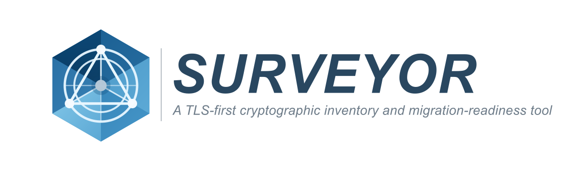

<div align="center">
  
</div>

# Audit

Audit is the current orchestration layer built on top of discovery and the existing TLS scanner.

It answers a different question from discovery:

given the endpoints Surveyor already found, which of them should be handed to a supported scanner, what was actually verified, and what was skipped?

## Current commands

The audit commands are:

```bash
surveyor audit local
surveyor audit remote --cidr 10.0.0.0/24 --ports 443,8443
surveyor audit remote --targets-file approved-hosts.txt --ports 443,8443
surveyor audit remote --inventory-file inventory.yaml
surveyor audit remote --inventory-file examples/ingress.yaml --adapter kubernetes-ingress-v1
surveyor audit remote --inventory-file Caddyfile --adapter-bin /path/to/caddy
```

`surveyor audit subnet` remains as a CIDR-only compatibility alias from `v0.4.x`.

## Why audit exists

Surveyor already has two distinct implemented primitives:

- discovery
- explicit-target TLS inventory

Audit exists to join them together while keeping the result honest:

- run discovery first
- preserve discovered endpoint facts and hints
- decide which endpoints are worth TLS scanning
- hand only the supported subset into the existing TLS scanner
- emit one combined report

## Command semantics

The semantics of `surveyor audit local` are:

- run local discovery first
- preserve discovered endpoint facts and protocol hints
- select supported scanners conservatively
- hand selected endpoints into existing scanner implementations
- record verified scan results separately from discovery results
- record skipped endpoints and the reason they were skipped
- emit canonical JSON and derived Markdown

The semantics of `surveyor audit remote` are:

- validate explicit remote scope first
- run remote discovery within that declared scope
- preserve discovered endpoint facts and protocol hints
- preserve imported inventory annotations when remote scope came from `--inventory-file`
- support explicit adapter-backed inventory input through `--inventory-file`
- select supported scanners conservatively
- hand only the supported TLS-like subset into the existing TLS scanner
- record verified TLS results separately from discovery and selection
- record skipped endpoints and the reason they were skipped
- emit canonical JSON and derived Markdown

Both commands follow the same output conventions:

- `-o, --output` for Markdown output
- `-j, --json` for JSON output
- Markdown to stdout when no output path is given

## Current scope

The current audit flow covers:

- local-only audit orchestration
- remote audit within explicitly declared scope and declared port surface
- remote audit within structured inventory scope, using per-entry ports or a `--ports` override
- discovery-first orchestration
- conservative TLS-candidate selection
- automatic handoff only to the existing TLS scanner
- one combined report covering both discovery and verified scan results
- explicit skip reasons for unscanned endpoints

The current audit flow does not cover:

- undeclared remote scope
- non-TLS deep scanners
- aggressive protocol probing
- broad vulnerability-scanner behaviour
- enterprise-wide orchestration

## Current selection rules

The current selection layer is intentionally narrow.

At the moment, audit will:

- skip discovery results that already contain endpoint-level errors
  - for remote discovery failures this becomes the explicit skip reason `endpoint did not respond during remote discovery`
- consider only TCP endpoints
- treat local `state=listening` as eligible
- treat remote `state=responsive` as eligible
- select only endpoints that already carry a conservative `tls` hint
- skip everything else explicitly with a reason

That keeps automatic handoff aligned with the currently supported scanner set and makes the report explain why something was or was not scanned.

## Facts, hints, selections and scans

Audit keeps five things separate:

1. discovered endpoint facts
2. protocol hints
3. scanner selection decisions
4. verified scan results
5. skipped endpoints and reasons

Examples:

- `scope_kind=remote`, `host=10.0.0.10`, `transport=tcp`, `port=443` are discovered facts
- `protocol=tls` with low confidence is a hint
- `selected_scanner=tls` is a selection decision
- negotiated TLS version, cipher suite and certificate metadata are verified scan results
- `reason=endpoint did not respond during remote discovery` is a skip outcome

Hints are not scans, and scanner selection is not verification.

## Audit schema

Audit follows the same output philosophy as the TLS and discovery slices:

- JSON is canonical
- Markdown is derived from the canonical model

### Top-level report

Current top-level audit report shape:

```json
{
  "schema_version": "1.0",
  "tool_version": "dev",
  "report_kind": "audit",
  "scope_kind": "remote",
  "scope_description": "remote audit from targets file examples/approved-hosts.txt over ports 443",
  "generated_at": "2026-04-16T02:00:00Z",
  "scope": {
    "scope_kind": "remote",
    "input_kind": "targets_file",
    "targets_file": "examples/approved-hosts.txt",
    "ports": [443]
  },
  "execution": {
    "profile": "cautious",
    "max_hosts": 256,
    "max_concurrency": 8,
    "timeout": "3s"
  },
  "results": [],
  "summary": {}
}
```

Fields:

- `schema_version`: current baseline-compatible schema version for report comparison
- `tool_version`: emitting Surveyor build version, currently `dev` for ordinary builds and tests
- `report_kind`: semantic top-level report kind, here `audit`
- `scope_kind`: high-level scope the report covers, here `local` or `remote`
- `scope_description`: human-readable summary of the audit scope represented by the report
- `generated_at`: RFC3339 UTC timestamp for report assembly time
- `scope`: declared scope metadata for the report
- `execution`: execution settings that materially shaped the run, currently present for remote audit
- `results`: one entry per discovered endpoint considered by the audit flow
- `summary`: aggregate counts derived from `results`

### Report scope

Current report-scope shape:

```json
{
  "scope_kind": "remote",
  "input_kind": "targets_file",
  "targets_file": "examples/approved-hosts.txt",
  "ports": [443]
}
```

Fields:

- `scope_kind`: `local` or `remote`
- `input_kind`: declared remote scope input kind when the report covers remote scope, currently `cidr`, `targets_file` or `inventory_file`
- `cidr`: declared remote CIDR when the report covers CIDR-backed remote scope
- `targets_file`: declared remote targets-file path when the report covers file-backed remote scope
- `inventory_file`: declared structured inventory-file path when the report covers inventory-backed remote scope
- `ports`: declared remote port set when the report covers remote scope

### Report execution

Current report-execution shape:

```json
{
  "profile": "cautious",
  "max_hosts": 256,
  "max_concurrency": 8,
  "timeout": "3s"
}
```

Fields:

- `profile`: effective remote pace profile
- `max_hosts`: effective expanded-host hard cap
- `max_concurrency`: effective remote probe concurrency cap
- `timeout`: effective per-attempt timeout used for remote probing and TLS connection attempts

### Audit result

Current per-endpoint audit result shape:

```json
{
  "discovered_endpoint": {},
  "selection": {},
  "tls_result": {}
}
```

Fields:

- `discovered_endpoint`: the discovered endpoint facts and hints as produced by the discovery layer
- `selection`: the scanner decision for this endpoint, including skipped outcomes
- `tls_result`: verified TLS result when the endpoint was selected for the TLS scanner and the scan ran

### Selection

Current selection shape:

```json
{
  "status": "selected",
  "selected_scanner": "tls",
  "reason": "tls hint on tcp/443"
}
```

Fields:

- `status`: selection outcome, currently `selected` or `skipped`
- `selected_scanner`: scanner identifier when selected, currently `tls`
- `reason`: explicit explanation for the decision

Skipped example:

```json
{
  "status": "skipped",
  "reason": "endpoint did not respond during remote discovery"
}
```

### Verified TLS result

When an endpoint is selected for TLS scanning, `tls_result` reuses the current canonical TLS result model rather than inventing a parallel TLS schema.

That means audit reuses the target-result contract documented in [docs/output-schema.md](output-schema.md).

### Summary

Current summary shape:

```json
{
  "total_endpoints": 3,
  "tls_candidates": 2,
  "scanned_endpoints": 2,
  "skipped_endpoints": 1,
  "selection_breakdown": {
    "tls": 2
  },
  "verified_classification_breakdown": {
    "modern_tls_classical_identity": 2
  }
}
```

Fields:

- `total_endpoints`: total number of discovered endpoints considered by the audit flow
- `tls_candidates`: endpoints selected for the TLS scanner
- `scanned_endpoints`: endpoints for which a supported scanner actually ran
- `skipped_endpoints`: endpoints not scanned
- `selection_breakdown`: counts keyed by selected scanner
- `verified_classification_breakdown`: counts keyed by verified TLS classification where a TLS scan completed

## Safety model

Audit stays conservative.

It:

- relies on discovery rather than inventing its own endpoint model
- only hands off to supported scanners intentionally
- preserves the difference between hinting and verification
- keeps unsupported or failed endpoints explicit in the report instead of silently dropping them

For `audit remote`, verified TLS results should be read as literal connection-path observations. IP-literal results in particular do not imply hostname validation or full virtual-host coverage behind the address.

## Current examples

Representative example outputs live in:

- [examples/audit.json](../examples/audit.json)
- [examples/audit.md](../examples/audit.md)
- [examples/audit-inventory.json](../examples/audit-inventory.json)
- [examples/audit-inventory.md](../examples/audit-inventory.md)
- [examples/audit-remote.json](../examples/audit-remote.json)
- [examples/audit-remote.md](../examples/audit-remote.md)
- [examples/audit-subnet.json](../examples/audit-subnet.json)
- [examples/audit-subnet.md](../examples/audit-subnet.md)

## Relationship to future work

Audit currently proves two orchestration shapes:

- local discovery into TLS scanning
- scoped remote discovery into TLS scanning

The next steps can build on that shared model instead of inventing parallel command paths.
